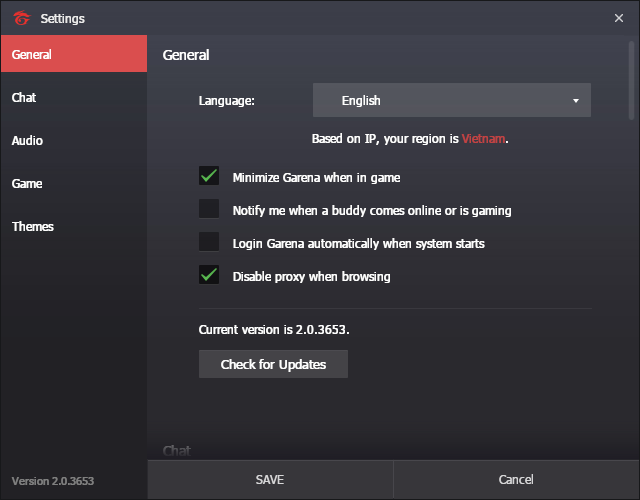
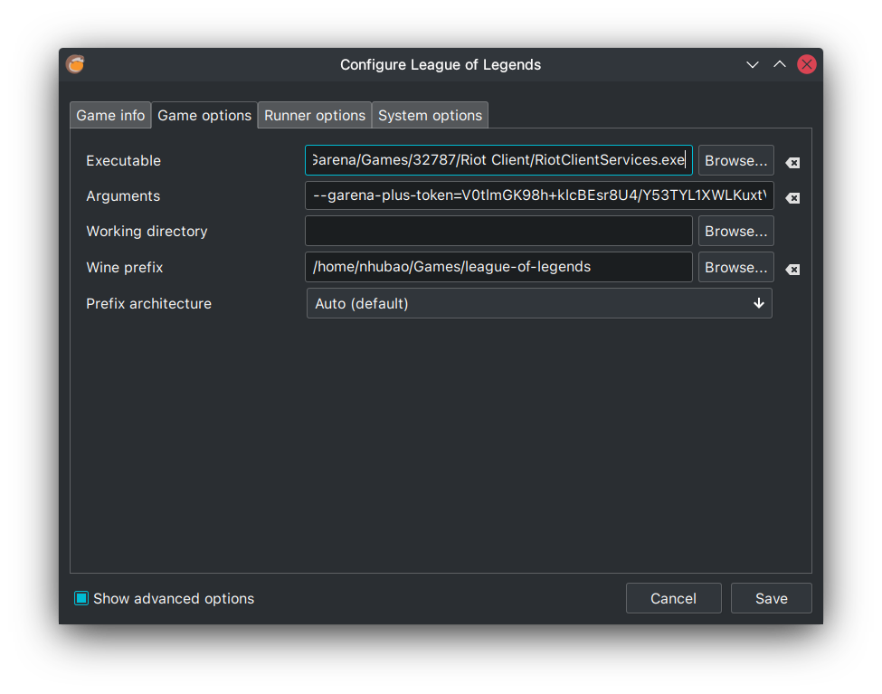
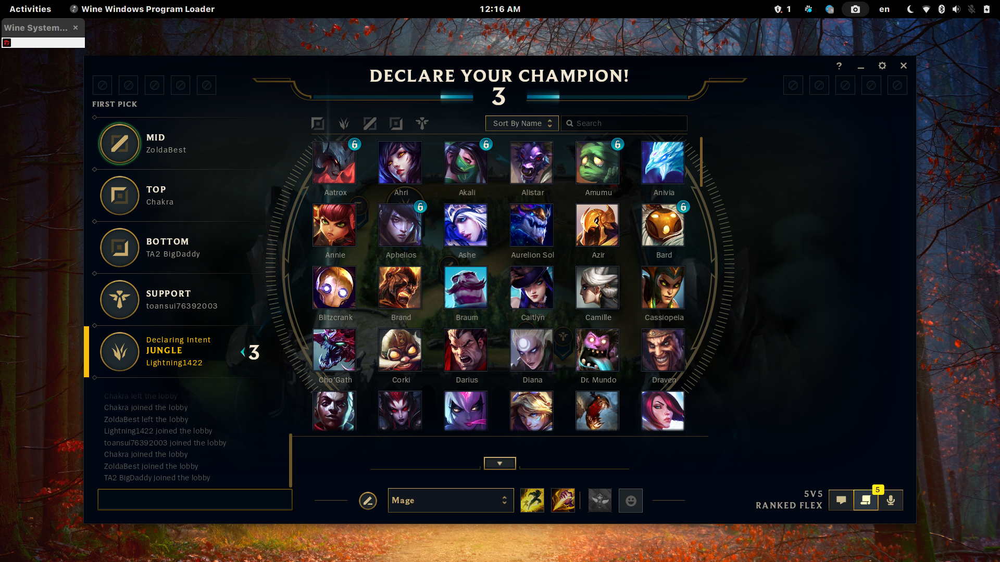

## Fixes for when a new LOL patch broke the game [`here`](./fixes/README.md)
---
## Please note that you are using this project on your own discretion, we don't hold any responsibility for any actions taken on you/on your account
---
## Those who cannot start LOL after the 11.17 update check here: [Update to newer wine-lol version](#update-new-wine-lol)
## You can also refer to [r/leagueoflinux](https://www.reddit.com/r/leagueoflinux/) for frequent updates regarding the game on linux
---
## The Garena Client is almost exclusively intended for Asia (Includes south, south-east, east, etc). If you do not belong to the aforementioned regions (Like NA, EU, etc.), Please use the Riot Client instead (What Lutris ships by default)
---
## This is the way I personally use to start LOL on Linux, through Lutris. The code for starting game without Lutris is still in the script though.
---
## I know that the Lutris Garena works ootb right now, but it has problem for me, namely the client does not show after a game, so I still keep this around
---
## Wine Dependency (Maybe redundant, but just to be sure nothing goes wrong)
**Source:** [https://www.gloriouseggroll.tv/how-to-get-out-of-wine-dependency-hell/](https://www.gloriouseggroll.tv/how-to-get-out-of-wine-dependency-hell/)

### EndeavourOS/Manjaro/Arch derivatives (enable multilib in pacman.conf):
```bash
sudo pacman -Sy wine-staging winetricks giflib lib32-giflib libpng lib32-libpng libldap lib32-libldap gnutls lib32-gnutls mpg123 lib32-mpg123 openal lib32-openal v4l-utils lib32-v4l-utils libpulse lib32-libpulse alsa-plugins lib32-alsa-plugins alsa-lib lib32-alsa-lib libjpeg-turbo lib32-libjpeg-turbo libxcomposite lib32-libxcomposite libxinerama lib32-libxinerama ncurses lib32-ncurses opencl-icd-loader lib32-opencl-icd-loader libxslt lib32-libxslt libva lib32-libva gtk3 lib32-gtk3 gst-plugins-base-libs lib32-gst-plugins-base-libs vulkan-icd-loader lib32-vulkan-icd-loader libjpeg6-turbo lib32-libjpeg6-turbo python-magic gamemode --needed
```
- For Intel GPU (integrated):
```bash
sudo pacman -Sy vulkan-intel lib32-vulkan-intel --needed
```
- For AMD GPU (interated and dedicated)
```bash
# Opensource amdgpu driver
sudo pacman -Sy vulkan-radeon lib32-vulkan-radeon --needed

# Proprietary amdgpu-pro driver
sudo pacman -Sy amdvlk lib32-amdvlk --needed
# Or install vulkan-amdgpu-pro and lib32-vulkan-amdgpu-pro (From AUR)
```
- For NVIDIA GPU (help wanted to verify)
```bash
sudo pacman -Sy nvidia-utils lib32-nvidia-utils nvidia-prime --needed
```
### Solus (help wanted to verify):
```
sudo eopkg install wine wine-devel wine-32bit-devel winetricks
```
### Ubuntu (help wanted to verify):
```
wget -nc https://dl.winehq.org/wine-builds/winehq.key
sudo apt-key add winehq.key
sudo apt-add-repository 'https://dl.winehq.org/wine-builds/ubuntu/'
sudo apt update
sudo apt install --install-recommends winehq-staging
sudo apt install winetricks
```
### Fedora (help wanted to verify):

Enable RPM Fusion repo
```
sudo dnf install https://mirrors.rpmfusion.org/free/fedora/rpmfusion-free-release-$(rpm -E %fedora).noarch.rpm https://mirrors.rpmfusion.org/nonfree/fedora/rpmfusion-nonfree-release-$(rpm -E %fedora).noarch.rpm
```
```
sudo dnf install lutris wine winetricks
```

```
sudo dnf groupinstall "C Development Tools and Libraries"
sudo dnf groupinstall "Development Tools"
```
# Install Lutris, Garena, LOL
- Follow Lutris official docs here: https://lutris.net/downloads/ to install lutris on your distro
- Run this script and follow the output
```bash
curl https://raw.githubusercontent.com/nhubaotruong/league-of-legends-linux-garena-script/main/install.py | python
```
After finishing each step, close all lutris windows
- Download the `lol.py` script

# Install LOL from Garena
Open Garena from lutris and install LOL like you normally do on Windows. 

Also, enable **Disable proxy when browsing** for better Garena experience (it sucks by default)


 - ## Change the installation directory (Optional, recommended to just leave default)
Open the Wine Prefix directory (where your Garena is actually installed)

For ex: `/home/nhubao/Games/garena/drive_c`

Create a new folder there, name it as you wish. For my case, I befittingly named it "fuck u garena"


The directory for the newly created folder should be something like the following example

`/home/nhubao/Games/garena/drive_c/fuck u garena`

Now, open the Garena Client via Lutris and change the installation directory for LoL

Garena Client --> League of Legends --> Wrench icon (in the bottom left of the page) --> Locate Game Files --> Change --> Locate the directory to the newly created folder


Now click Install and it should now start installing!

- ## Alternative Method For Installing LoL

If for some reason the installation doesn't complete via the Garena Client, try the folllowing method:-

1) Head over to the download link of your region
   - Singapore, Malaysia, and Indonesia: [https://lol.garena.com/download](https://lol.garena.com/download)
   - Vietnam: [https://lienminh.garena.vn/download](https://lienminh.garena.vn/download)
   - Phillipines: [https://lol.garena.ph/download](https://lol.garena.ph/download)
   - Taiwan, Hong Kong, and Macau: [https://lol.garena.tw/download](https://lol.garena.tw/download)
   - Thailand: [https://lol.garena.in.th/download](https://lol.garena.in.th/download)

If you wish to inform us about different language options, please raise an issue and we will add it!

2) Click on Game Download


`It's the Ezreal image for other regions`

3) Save the file and wait for it to install

4) Extract the folder into the directory where the game is supposed to be installed by Garena

For Ex: `/home/nhubao/Games/garena-vn/drive_c/fuck u garena`

5) Head over to Lutris, select the Garena client and under the options for Wine, select Run EXE inside Wine Prefix


6) You will now be prompted by an installer which will extract all the game assets, click Next and the installation should begin


7) This is how it should look like now!


# Config LOL Lutris

## Using script
```bash
curl https://raw.githubusercontent.com/nhubaotruong/league-of-legends-linux-garena-script/main/config.py | python
```

## Manual:

Riot LOL Installation(How LOL comes by default from Lutris):
> /home/nhubao/Games/league-of-legends/drive_c/Riot Games/League of Legends/LeagueClient.exe

Change the above directory to the one below(How it should look like for Garena LOL to work)
> /home/nhubao/Games/garena/drive_c/Garena/Games/32771/Riot Client/RiotClientServices.exe


# Start the game
* Download the `lol.py` script
* Start Garena
* Open terminal, ```cd``` into the directory where you have the `lol.py` and run
```bash
python lol.py
```
* Select "League of Legends" in the Garena client and press **Play**
* The launch should be nearly instantaneous if all steps have been followed correctly.
- ## Note: If you are running the game for the first time after these steps have been followed, You may be prompted for some sort of anti-cheat stuff, choose an option suitable for you and continue. Subsequent launches may be faster.
# Note: It may take a few minutes to start, give it some time, it may show the Play option again, just ignore it.
# Overview of what your settings should look like


- ## Ignore the `Arguements` in the following screenshot, those are generated by the script when the game launches.


- ## The following settings are subjective and mostly used for troubleshooting. This is what it looks by default.


# Result


# Update new wine-lol
1. Use `lutris-ge-lol-*` from lutris (Here, `*` signifies the latest version and release)
- Go to `Manage runners` --> `Manage Versions` and install the latest `lutris-ge-lol`
- Change the wine version of LOL( `Configure`--> `Runner Options` --> `Wine Version`) to `lutris-ge-lol-*`

# Disclaimer
* If the game crash with some message that saids `core dump...` just press `OK` and wait a bit, the game will continue at the exact state
