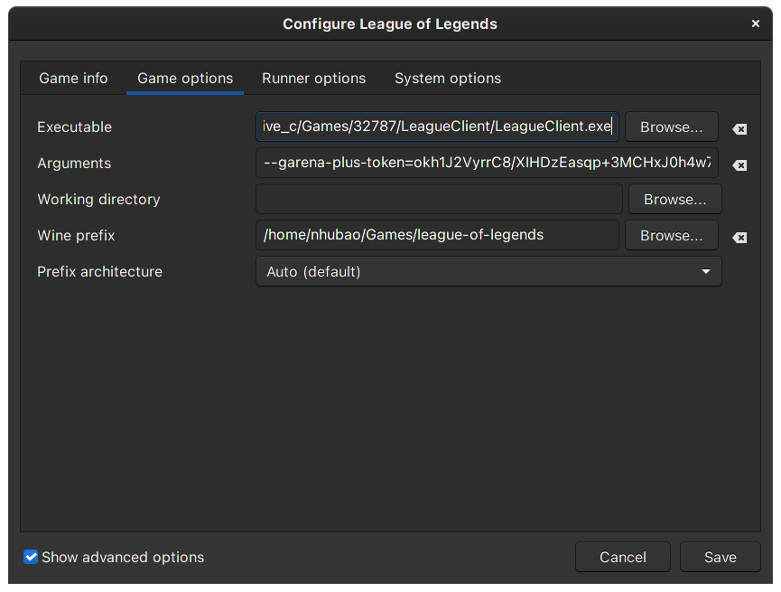

## Please note that you are using this project on your own discretion, we don't hold any responsibility for any actions taken on you/on your account
## Those who cannot start LOL after the 11.17 update check here: [Update to newer wine-lol version](#update-new-wine-lol)
## You can also refer to [r/leagueoflinux](https://www.reddit.com/r/leagueoflinux/) for frequent updates regarding the game on linux
## The Garena Client is almost exclusively intended for Asia (Includes south, south-east, east, etc). If you do not belong to the aforementioned regions (Like NA, EU, etc.), Please use the Riot Client instead(What Lutris ships by default)
## This is the way I personally use to start LOL on Linux, through Lutris. The code for starting game without Lutris is still in the script though.
## Wine Dependency (Maybe redundant, but just to be sure nothing goes wrong)
**Source:** [https://www.gloriouseggroll.tv/how-to-get-out-of-wine-dependency-hell/](https://www.gloriouseggroll.tv/how-to-get-out-of-wine-dependency-hell/)

### Antergos/Manjaro/Arch derivatives (enable multilib in pacman.conf):
```
sudo pacman -Sy
sudo pacman -S wine-staging winetricks
sudo pacman -S giflib lib32-giflib libpng lib32-libpng libldap lib32-libldap gnutls lib32-gnutls mpg123 lib32-mpg123 openal lib32-openal v4l-utils lib32-v4l-utils libpulse lib32-libpulse alsa-plugins lib32-alsa-plugins alsa-lib lib32-alsa-lib libjpeg-turbo lib32-libjpeg-turbo libxcomposite lib32-libxcomposite libxinerama lib32-libxinerama ncurses lib32-ncurses opencl-icd-loader lib32-opencl-icd-loader libxslt lib32-libxslt libva lib32-libva gtk3 lib32-gtk3 gst-plugins-base-libs lib32-gst-plugins-base-libs vulkan-icd-loader lib32-vulkan-icd-loader cups samba dosbox
```
### Solus:
```
sudo eopkg install wine wine-devel wine-32bit-devel winetricks
```
### Ubuntu:
```
wget -nc https://dl.winehq.org/wine-builds/winehq.key
sudo apt-key add winehq.key
sudo apt-add-repository 'https://dl.winehq.org/wine-builds/ubuntu/'
sudo apt update
sudo apt install --install-recommends winehq-staging
sudo apt install winetricks
```
### Fedora:

Enable RPM Fusion repo
```
sudo dnf install https://mirrors.rpmfusion.org/free/fedora/rpmfusion-free-release-$(rpm -E %fedora).noarch.rpm https://mirrors.rpmfusion.org/nonfree/fedora/rpmfusion-nonfree-release-$(rpm -E %fedora).noarch.rpm
```
```
sudo dnf install lutris wine winetricks
```

```
sudo dnf groupinstall "C Development Tools and Libraries"
sudo dnf groupinstall "Development Tools"
```
# Install Lutris
**Follow Lutris official docs here:** [https://lutris.net/downloads/](https://lutris.net/downloads/)

- ## Install Garena and LOL from Lutris
**Garena:** [https://lutris.net/games/garena/](https://lutris.net/games/garena/)

**Note for Garena:** After installing Garena, do not login, close the window

**LOL:** [https://lutris.net/games/league-of-legends/](https://lutris.net/games/league-of-legends/)

**Note for LOL:** when the installer for LOL NA comes up, just close it, you don't need to install it, we just need the environment

- ## Install LOL from Garena
Open Garena from lutris and install LOL like you normally do on Windows. 

Also, enable **Disable proxy when browsing** for better Garena experience (it sucks by default)


# Config LOL Lutris
Change the default Executable in Riot LOL(the default LOL Installation for Lutris) to **LeagueClient.exe** (thanks to [abiswas97](https://github.com/abiswas97)) from the LOL-Garena installed location. 

- ## For example:

Riot LOL Installation(How LOL comes by default from Lutris):
> /home/nhubao/Games/league-of-legends/drive_c/Riot Games/League of Legends/LeagueClient.exe

Change the above directory to the one below(How it should look like for Garena LOL to work)
> /home/nhubao/Games/garena/drive_c/Garena/Games/32771/LeagueClient/LeagueClient.exe


# Installing the necessary scripts
* You can either directly download this repository by downloading the .zip/.tar.gz file and extracting it 

OR

* ```git clone https://github.com/nhubaotruong/league-of-legends-linux-garena-script.git```
# Start the game
* Install the following dependencies(This is a one-time step):
```
pip3 install psutil pyyaml
```
* Start Garena
* Open terminal, ```cd``` into the directory where you have saved this repository(Ex: /home/nhubao/league-of-legends-linux-garena-script-main) and run the following script:
```
python3 lol.py
```
* Select "League of Legends" in the Garena client and press **Play**
* The launch should be nearly instantaneous if all steps have been followed correctly.
- ## Note: If you are running the game for the first time after these steps have been followed, You may be prompted for some sort of anti-cheat stuff, choose an option suitable for you and continue. Subsequent launches may be faster.

# Overview of what your settings should look like


- ## Ignore the `Arguements` in the following screenshot, those are generated by the script when the game launches.


- ## The following settings are subjective and mostly used for troubleshooting. This is what it looks by default.


# Result


# Update new wine-lol
1. Use `lutris-ge-lol-*` from lutris (Here, `*` signifies the latest version and release)
- Go to `Manage runners` --> `Manage Versions` and install the latest `lutris-ge-lol`
- Change the wine version of LOL( `Configure`--> `Runner Options` --> `Wine Version`) to `lutris-ge-lol-*`

2. Custom `wine-lol`
- It currently only have prebuilt for Ubuntu/Debian based and PKGBUILD for arch based: https://github.com/ekistece/wine-lol
- After installing both `wine-lol` and `wine-lol-glibc`, change the wine version of LOL in lutris to custom and enter this path: `/opt/wine-lol/bin/wine`

# Disclaimer
* If the game crash with some message that saids `core dump...` just press `OK` and wait a bit, the game will continue at the exact state
